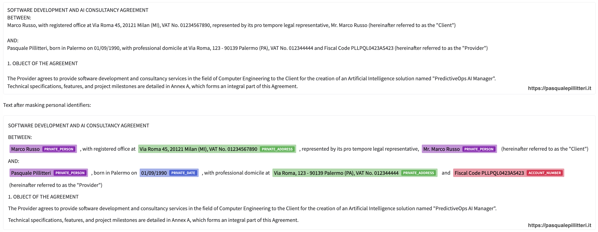

# Claude Privacy Tool

> 🟨 **ピュア JavaScript エディション** · Python 不要、venv 不要。Node.js 20+ のみ。

<p align="center">
  
</p>

**ワンライナーでインストール。Claude到達前に個人データをマスク。**

> 📖 **ブログの完全ガイド:** [OpenAI Privacy Filter: 個人データをオフラインでマスクする無料オープンソースモデル (GPU と CPU)](https://pasqualepillitteri.it/news/1350/openai-privacy-filter-pii-masking-offline-gpu-cpu)

**Claude Code CLI**と**Claude Desktop**の全リクエストを仮名化。氏名、メール、電話、住所、IBAN、APIキー、日付は送信前に`[PRIVATE_PERSON_1]`等へ置換。元値は`~/.claude/privacy-tool/mappings/`に保存。

[OpenAI Privacy Filter](https://huggingface.co/openai/privacy-filter)(Apache 2.0、15億パラメータ)ベース。CPU/GPUで100%オフライン。

他の言語で読む: [English](README.md) · [Italiano](README.it.md) · [Français](README.fr.md) · [Español](README.es.md) · [Deutsch](README.de.md) · [Türkçe](README.tr.md) · [Русский](README.ru.md) · [中文](README.zh.md) · [Português](README.pt.md)

---

## インストール(ワンライナー)

```bash
npm install -g claude-privacy-tool
claude-privacy-tool install
```

インストーラー動作:
1. `~/.claude/privacy-tool/runtime`にNode.js runtime作成
2. モデル(約3GB、初回のみ)DL
3. Claude Codeフック登録(`settings.json`)
4. Claude DesktopにMCP登録(`claude_desktop_config.json`)
5. スモークテスト

**要件:** Node.js 20+、空き約3GB。GPU任意(10倍高速)。

## 使い方

### Claude Code CLI
通常通り`claude`を起動。全プロンプトは自動仮名化、応答は表示前に元値へ復元。

```bash
claude
> 顧客Mario Rossi(mario@example.com、IBAN IT60X0542...)宛ての返信を書いて
```

ログ確認。
```bash
tail -f ~/.claude/privacy-tool/hook.log
```

### Claude Desktop
Claude Desktopを再起動。MCPサーバー`claude-privacy-tool`配下に4ツール:

| ツール | 機能 |
|------|---------|
| `privacy_sanitize(text, session_id)` | PIIをプレースホルダーへ |
| `privacy_desanitize(text, mapping_id, session_id)` | 実値へ復元 |
| `privacy_list_sessions()` | 保存セッション一覧 |
| `privacy_purge_session(session_id)` | GDPR忘れられる権利 |

Claude Desktopでの例:
> `privacy_sanitize`でこのテキストをサニタイズ、session_id「causa_2026_bianchi」:
> 「Mario Rossi、1982年5月4日Palermo生まれ、事務所に依頼するため...」

Claudeはマスク版を返すので作業し、実名が要る時に`privacy_desanitize`を呼ぶ。

## マスク対象

OpenAI Privacy Filterの8つのPIIカテゴリー:

- `private_person` 氏名
- `private_address` 住所
- `private_email` メール
- `private_phone` 電話
- `private_url` 個人識別子入りURL
- `private_date` 生年月日・機微な日付
- `account_number` IBAN、税番号、VAT番号
- `secret` パスワード、APIキー、トークン

## アンインストール

```bash
claude-privacy-tool uninstall
```

フック、MCP、runtime、モデルキャッシュを削除。マッピングは確認まで残存。

## 動作の仕組み

```
  あなた ──実データ入りプロンプト──► hook ──サニタイズ済み──► Claude
                                 │
                       マッピングをローカル保存
                                 │
  あなた ◄──復元された応答── hook ◄──プレースホルダー── Claude
```

仮名化は全てローカル。Anthropicはプレースホルダーのみ見る。プレースホルダー→実値の辞書は`~/.claude/privacy-tool/mappings/`に権限`0600`で保存。

## 対象ユーザー

- **弁護士** 顧客名を出さず書面作成(守秘義務)
- **医師** 患者データなしで診断書作成(医療守秘義務)
- **DPO・コンプラ担当** GDPR違反なくClaudeに問合せ
- **開発者** 実APIキーなしでコードデバッグ
- **コンサル、専門家、会計士** 第三者データを扱う方

## 制限事項

- 仮名化であり匿名化ではない。マッピング保持者は再識別可能。`~/.claude/privacy-tool/mappings/`はディスク暗号化(FileVault、LUKS、BitLocker)で保護。
- ポリシーレビューやDPIAの代替ではない。
- CPUは1〜3秒/プロンプト。GPUは100〜300ms。

## ライセンス

MIT

## 作者

Pasquale Pillitteri [pasqualepillitteri.it](https://pasqualepillitteri.it)

参考記事: [OpenAI Privacy Filterガイド](https://pasqualepillitteri.it/news/1350/openai-privacy-filter-pii-masking-offline-gpu-cpu)
