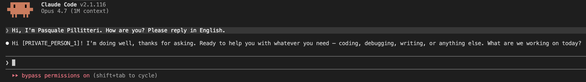

# Claude Privacy Tool

> 🟨 **Edição JavaScript pura** · Zero Python, zero venv. Apenas Node.js 20+.

<p align="center">
  
</p>

**Instalação em uma linha. Mascare os dados pessoais antes que cheguem ao Claude.**

> 📖 **Guia completo no blog:** [OpenAI Privacy Filter: o modelo open-source gratuito que mascara dados pessoais offline (GPU e CPU)](https://pasqualepillitteri.it/news/1350/openai-privacy-filter-pii-masking-offline-gpu-cpu)

> 🐍 **Prefere Python?** Edição Python original com `transformers` + `torch`: [claude-privacy-tool](https://github.com/pasqualepillitteri/claude-privacy-tool)

Claude Privacy Tool pseudonimiza cada prompt que você envia ao **Claude Code CLI** e cada solicitação feita pelo **Claude Desktop**. Nomes, e-mails, telefones, endereços, IBAN, API keys e datas são substituídos por placeholders como `[PRIVATE_PERSON_1]` antes de sair do seu computador. Os valores originais permanecem localmente em `~/.claude/privacy-tool/mappings/`.

Baseado no [OpenAI Privacy Filter](https://huggingface.co/openai/privacy-filter) (Apache 2.0, 1,5B parâmetros). Executa 100% offline em CPU ou GPU.

Leia em outras línguas: [English](README.md) · [Italiano](README.it.md) · [Français](README.fr.md) · [Español](README.es.md) · [Deutsch](README.de.md) · [Türkçe](README.tr.md) · [Русский](README.ru.md) · [中文](README.zh.md) · [日本語](README.ja.md)

---


## Exemplo real

<p align="center">
  
</p>

O nome "Pasquale Pillitteri" é substituído por `[PRIVATE_PERSON_1]` antes que o prompt chegue ao Claude. A resposta volta com o valor real graças à desanonimização local.

## Instalação (uma linha)

```bash
npm install -g claude-privacy-tool
claude-privacy-tool install
```

É só isso. O instalador:
1. Usa o Node.js do sistema (sem venv, sem compilação)
2. Baixa o modelo (~3 GB, uma única vez)
3. Registra os hooks no Claude Code (`settings.json`)
4. Registra um servidor MCP no Claude Desktop (`claude_desktop_config.json`)
5. Executa um smoke test

**Requisitos:** Node.js 20+, ~3 GB livres. GPU opcional (velocidade x10).

## Uso

### Claude Code CLI
Inicie `claude` como de costume. Cada prompt é automaticamente pseudonimizado. As respostas são restauradas com os valores originais antes de serem exibidas para você.

```bash
claude
> Escreva uma resposta ao meu cliente Mario Rossi (mario@example.com, IBAN IT60X0542...)
```

Verifique o log:
```bash
tail -f ~/.claude/privacy-tool/hook.log
```

### Claude Desktop
Reinicie o Claude Desktop. Aparecem 4 ferramentas no servidor MCP `claude-privacy-tool`:

| Ferramenta | O que faz |
|------|---------|
| `privacy_sanitize(text, session_id)` | Substitui os PII por placeholders |
| `privacy_desanitize(text, mapping_id, session_id)` | Restaura os valores reais |
| `privacy_list_sessions()` | Lista as sessões salvas |
| `privacy_purge_session(session_id)` | Direito ao esquecimento GDPR |

Exemplo dentro do Claude Desktop:
> Sanitize este texto com `privacy_sanitize`, session_id "causa_2026_bianchi":
> "Mario Rossi, nascido em 04/05/1982 em Palermo, procura o escritório para..."

Claude devolve a você a versão mascarada, trabalha sobre ela, e você chama `privacy_desanitize` quando precisa dos nomes reais.

## O que é mascarado

Oito categorias PII do OpenAI Privacy Filter:

- `private_person` nomes e sobrenomes
- `private_address` endereços postais
- `private_email` e-mails
- `private_phone` telefones
- `private_url` URLs com identificadores pessoais
- `private_date` datas de nascimento / sensíveis
- `account_number` IBAN, códigos fiscais, P.IVA
- `secret` senhas, API keys, tokens

## Desinstalação

```bash
claude-privacy-tool uninstall
```

Remove hooks, servidor MCP, runtime e cache do modelo. Os mappings permanecem até que você confirme a exclusão.

## Como funciona

```
  você ──prompt com dados reais──► hook ──texto sanitizado──► Claude
                                 │
                       mapping salvo localmente
                                 │
  você ◄──resposta restaurada── hook ◄──placeholder── Claude
```

Toda a pseudonimização acontece localmente. A Anthropic vê apenas placeholders. O dicionário placeholder → valor real vive em `~/.claude/privacy-tool/mappings/` com permissões `0600`.

## Para quem serve

- **Advogados** para redigir atos sem expor nomes dos clientes (sigilo profissional)
- **Médicos** para laudos sem expor dados do paciente (sigilo médico)
- **DPO e responsáveis por compliance** para consultar o Claude sem violar o GDPR
- **Desenvolvedores** para depurar código sem colar API keys reais
- **Consultores, peritos, contadores** que lidam com dados pessoais de terceiros

## Limitações

- É pseudonimização, não anonimização. Quem tem o mapping pode reidentificar. Proteja `~/.claude/privacy-tool/mappings/` com criptografia de disco (FileVault, LUKS, BitLocker).
- Não substitui a revisão de política ou a DPIA.
- Latência CPU 1-3 segundos por prompt. GPU 100-300 ms.

## Licença

MIT

## Autor

Pasquale Pillitteri [pasqualepillitteri.it](https://pasqualepillitteri.it)

Artigo de referência: [Guia OpenAI Privacy Filter](https://pasqualepillitteri.it/news/1350/openai-privacy-filter-pii-masking-offline-gpu-cpu)
